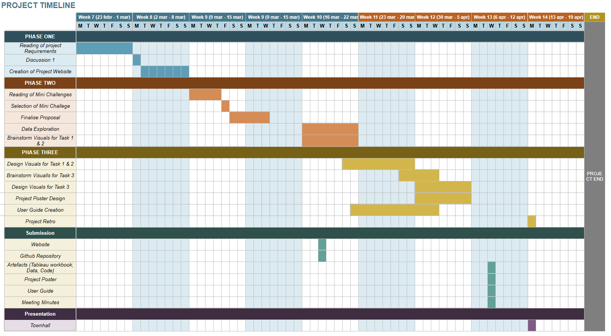

# Project Motivation
The rise of Sailor Shift from a local Oceanus Folk artist to a global music icon has transformed both the perception of Oceanus Folk and the cultural and economic landscape of Oceanus. What was once a niche, regionally confined genre has evolved into an internationally recognized musical movement, influencing diverse genres and artists worldwide. This transformation has not only elevated lesser-known artists but also contributed to increased tourism and global cultural interest in Oceanus.

Despite this growth, there is limited structured understanding of how Sailor’s career, collaborations, and artistic evolution have shaped the broader music ecosystem. By leveraging a rich knowledge graph of artists, songs, albums, and influences, this project aims to uncover hidden patterns, trace influence pathways, and provide data-driven insights into the evolution of Oceanus Folk and its global impact.

Ultimately, the motivation is to support storytelling for the journalist Silas Reed through compelling visual analytics, while deepening understanding of how individual artists can drive genre evolution and industry-wide change.

# Project Objectives

The objectives of this project are centred on uncovering and visualising the evolution of Sailor Shift’s career and the broader impact of Oceanus Folk on the global music landscape. By leveraging a comprehensive knowledge graph of artists, songs, albums, and influences, the project aims to analyse patterns of collaboration, trace the flow of musical influence, and understand how individual success can shape an entire genre. Through interactive visualisations and comparative analysis, the project will not only explore the spread and transformation of Oceanus Folk over time but also identify key characteristics of rising artists and generate data-driven predictions about the next wave of talent in the industry.

1. Analyse Sailor Shift’s Career and Influence
* Identify key artists and genres that have influenced Sailor over time
* Map her collaborations and determine both direct and indirect influence networks
* Examine how her artistic evolution reflects broader industry trends

2. Understand Influence Propagation
* Visualise how Sailor Shift has influenced: her collaborators, former bandmates. the wider Oceanus Folk community
* Trace influence pathways across artists, genres, and time

3. Explore the Evolution of Oceanus Folk
* Analyse how Oceanus Folk has spread globally
* Determine whether its growth was gradual or driven by key breakthrough moments (e.g., viral success)
* Identify genres and leading artists most impacted by Oceanus Folk

4. Examine Reverse Influence on Oceanus Folk
* Investigate how Oceanus Folk has evolved in response to global exposure
* Identify external genres that now influence modern Oceanus Folk
* Highlight shifts in musical style and collaboration patterns

5. Develop Artist Success Profiles
* Use visual analytics to define characteristics of a “rising star” in the music industry
Identify patterns in career trajectories, collaboration networks, and genre diversification

6. Comparative Artist Analysis
* Select and visualise the careers of three artists
* Compare their growth in popularity, influence networks, and career milestones
* Highlight similarities and differences in success pathways

7. Predict Future Oceanus Folk Stars
* Apply insights from influence patterns and success profiles
* Identify and justify three emerging artists likely to rise in the next five years

8. Build Visual Analytics Tools
* Design interactive visualisations 
* Enable intuitive exploration of  artist relationships, influence flows and genre evolution

# Scope of Work:

1. Data Preparation
* Clean, preprocess, and structure the knowledge graph dataset, ensuring consistency across entities such as artists, albums, songs, genres, and influence relationships.

2. Data Analysis
* Conduct initial analysis to identify key patterns, trends, and relationships in artist influence, collaborations, comparative artist analysis and genre evolution.

3. Influence and Network Analysis
* Map and analyse direct and indirect influence pathways between artists, including Sailor Shift’s role within the broader music ecosystem.

4. Data Visualisation and Analytics
* Creation of interactive charts and visualisations to effectively communicate our findings and analysis.

5. Create a User Guide
* A step-by-step guide on how to use the data visualisation functions is designed.

6. Preparing project poster 

7. Publish project webpage.

# Project Timeline
[{fig-align="left"}](https://docs.google.com/spreadsheets/d/e/2PACX-1vQiuRCJoEcqpmmGWsKQ6xstGcT7NOfFdldVl7IZK2V5Mc8s9eqrsIseAn3jqgqsomT30BmdB2neR8d0/pubhtml?gid=61476997&single=true)
