::: {.callout-note}
## Project Resources

[View GitHub Repository](https://github.com/cakemerc01/IS428_G2_VA-Project){.btn .btn-primary target="_blank"}

### Tableau
- <https://public.tableau.com/app/profile/yi.ning.choo/viz/VastChallenge2025MC1Task1/SailorShiftsCareerProfile>
:::

---

# Task 1: Understanding Sailor Shift's Career Profile

### Who has she been most influenced by over time?

::: {.columns}
::: {.column width="50%"}
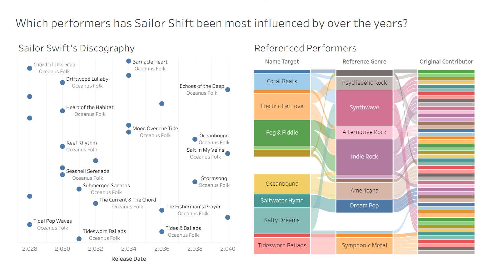{fig-align="center" width="100%"}
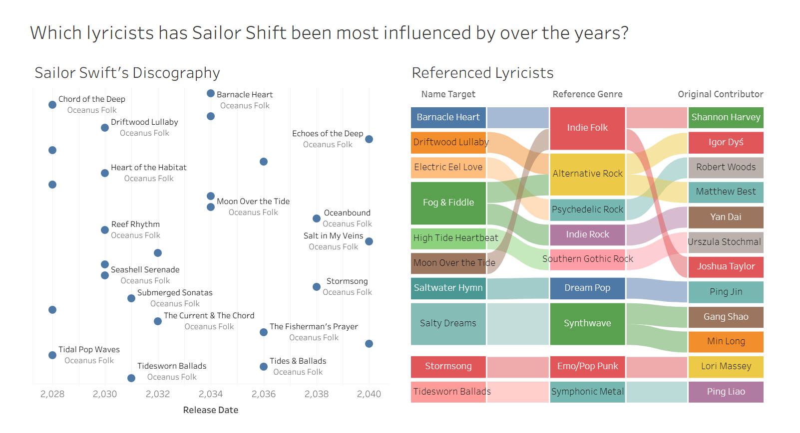{fig-align="center" width="100%"}
:::

::: {.column width="50%"}
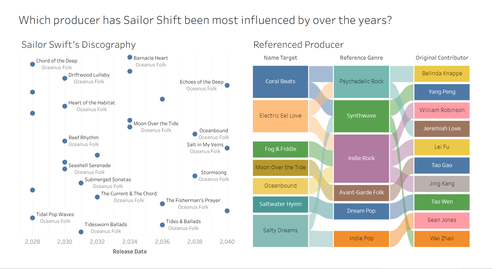{fig-align="center" width="100%"}
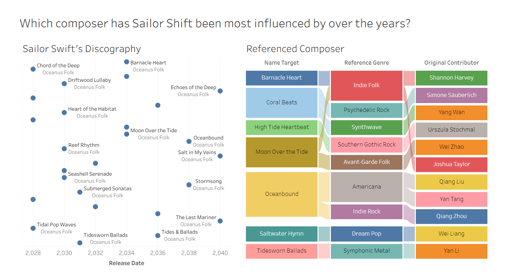{fig-align="center" width="100%"}
:::
:::

Sankey Diagram -

To identify Sailor Shift’s primary influences, we analyzed the producers, composers, lyricists, and performers associated with the works she has referenced throughout her career. We chose to use Sankey diagrams because they effectively visualize the complex lineage of her inspiration.

In our dataset, there were no direct edges or nodes that explicitly defined who influenced Sailor Shift. Instead, the data was structured such that “Sailor song/album” nodes were connected to “person” nodes via an intermediate “source” node (representing a specific song or album by another artist).

By tracing these paths, we were able to map how individual contributors link back to her specific works. This indirect mapping allowed us to derive a comprehensive view of her influences.

Analysis: The resulting Sankey diagrams reveal a dense, interconnected web, indicating that her work does not stem from a single source. No individual contributor emerges as a dominant influence. Sailor Shift’s creative direction is guided less by specific individuals and more by broader musical movements, with genres such as Indie Rock, Synthwave, and Indie Folk serving as the foundational pillars of her sound.

### Who has she collaborated with and directly or indirectly influenced?

::: {.columns}
::: {.column width="50%"}
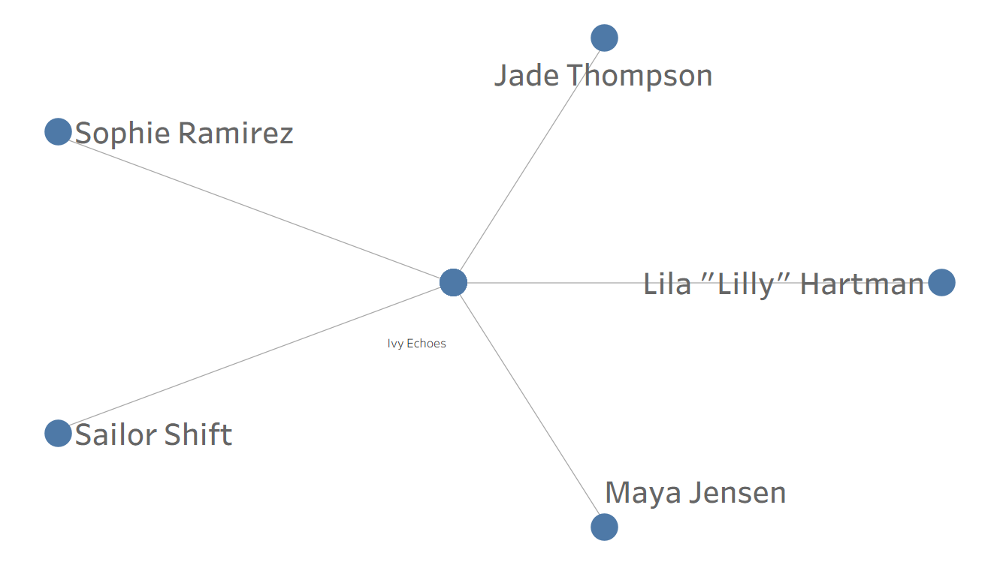{fig-align="center" width="100%"}
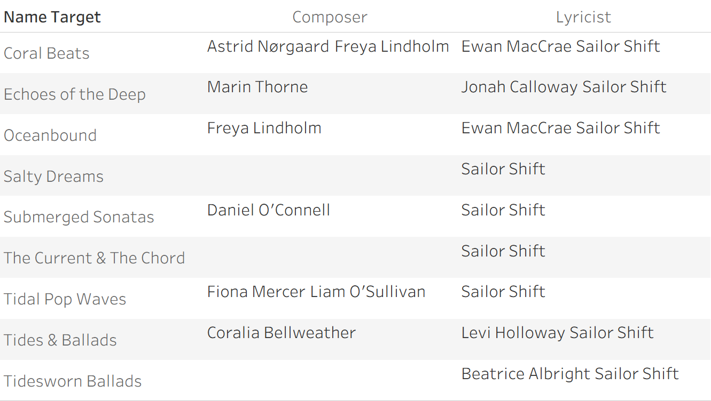{fig-align="center" width="100%"}
:::

::: {.column width="50%"}
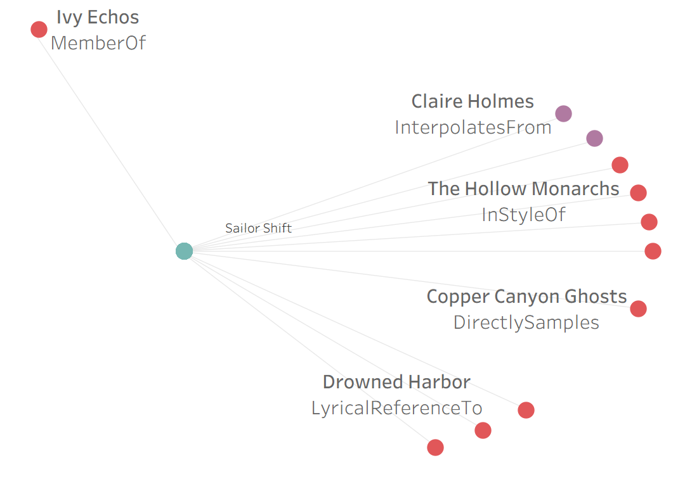{fig-align="center" width="100%"}
:::
:::

Network Diagram -

A network diagram was used to map Sailor Shift’s professional network, as the dataset is inherently relational, making it the most appropriate visualization method. To identify who she has collaborated with, we first examined her previous bandmates and constructed a network diagram of her band connections. This allowed us to clearly visualize her immediate collaborative circle.

We identified the band Ivy Echoes and, from there, key collaborators such as Maya Jenson, Sophie Ramirez, Jade Thompson, and Lila “Lilly” Hartman. The network diagram highlights these individuals as central nodes within her early career collaborations.

Table -
Beyond her bandmates, producers and composers also represent an important group of collaborators. For this subset, a table was used as it provides a clear and structured view of relationships. The table allows us to easily identify which individuals Sailor Shift worked with on specific songs across her career, making it effective for detailed comparison.

Ego Network -

An ego network was constructed with Sailor Shift at the center to further analyze her position and influence within the broader network. This visualization focuses on her direct connections while still providing insight into how she is referenced within the network.

Analysis: A key observation is that other artists in the dataset are typically referenced through specific songs or albums. In contrast, Sailor Shift is referenced as an individual node rather than through her works, for example, Claire Holmes. This suggests that her influence extends beyond her body of work, indicating that she functions as a broader creative archetype within the network.

### How has she influenced collaborators of the broader Oceanus Folk community?

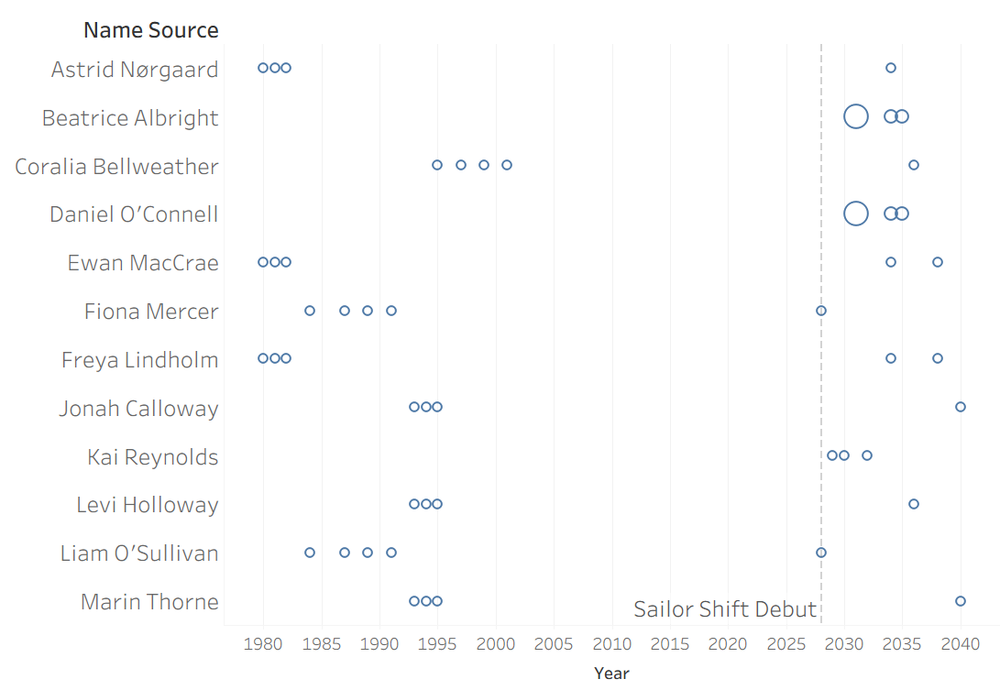{fig-align="center" width="100%"}

::: {.columns}
::: {.column width="50%"}
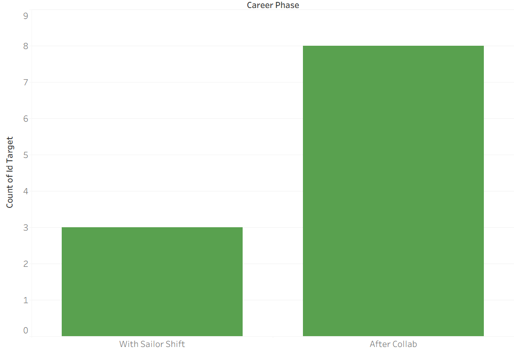{fig-align="center" width="100%"}
:::

::: {.column width="50%"}
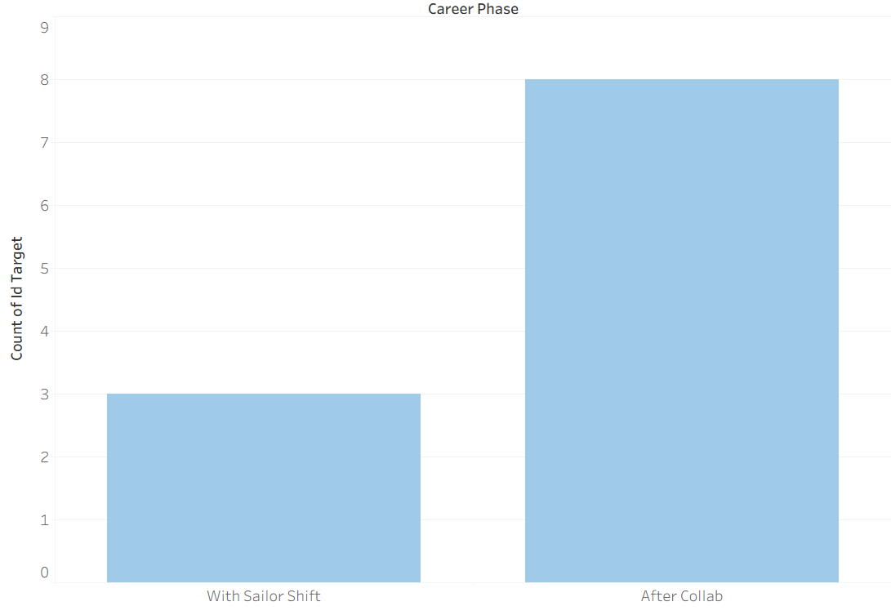{fig-align="center" width="100%"}
:::
:::

::: {.columns}
::: {.column width="50%"}
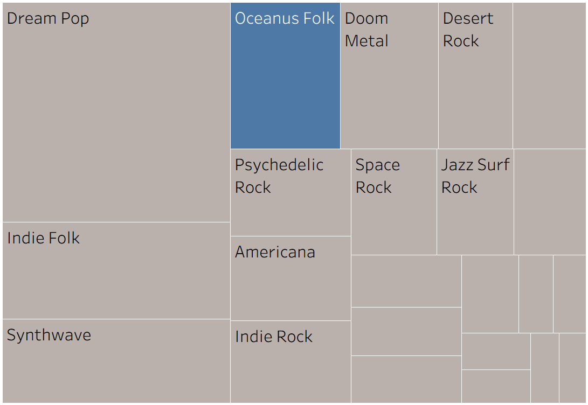{fig-align="center" width="90%" fig-cap="2020}
:::

::: {.column width="50%"}
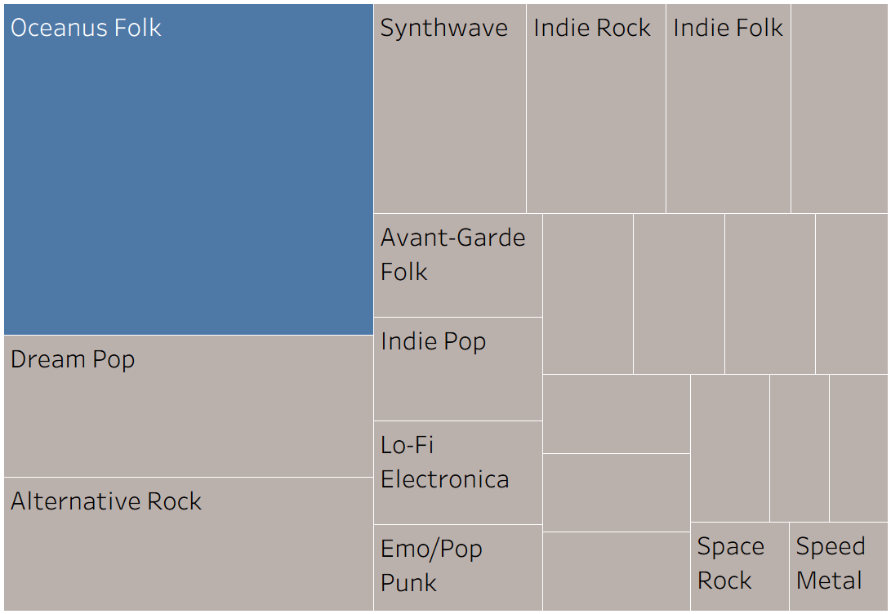{fig-align="center" width="90%" fig-cap="2030}
:::
:::

Dot Chart -

A dot chart was used to visualize collaborator activity, specifically tracking the release frequency of Sailor Shift’s collaborators over time. Each dot represents an individual collaborator’s release at a given point in time, allowing us to compare their activity levels before and after Sailor’s debut. We used her debut single in 2028 as a reference point to observe any shifts in release patterns. The dot chart makes it easy to identify trends such as gaps in activity, sudden increases in output, and overall changes in momentum.

Analysis: The most notable finding is that Sailor Shift’s debut marked a turning point for several collaborators. Multiple veteran artists experienced long periods of inactivity prior to 2028, followed by a clear resurgence in releases after collaborating with her. This suggests that her debut played a role in bringing established artists out of hiatus. Additionally, newer artists such as Beatrice Albright and Daniel O’Connell exhibit a different pattern—after collaborating with Sailor Shift, they significantly increased their output within the Oceanus Folk genre. This indicates that her influence not only revitalizes established artists but also helps shape the artistic direction of emerging ones.

Treemap -

A treemap was used to visualize the proportion of songs released across different genres, allowing for an easy comparison of genre dominance. We focused on two decades—the 2020s and the 2030s—to capture changes before and after Sailor Shift’s rise to fame. The size of each block represents the number of songs within a genre, making shifts in genre popularity immediately visible.

Analysis: The treemap highlights a clear shift in genre dominance over time. During the 2020s, Dreampop was the most prominent genre, dominating the musical landscape during Sailor’s early rise. However, in the 2030s, Oceanus Folk experienced a significant surge, overtaking other genres to become the most dominant. This transition suggests a strong correlation between Sailor Shift’s career trajectory and the rise of Oceanus Folk. While causation cannot be definitively established, the alignment of her growing influence with the genre’s expansion indicates that she likely played a key role in shaping this broader industry trend.

---

# Task 2: Understanding the Influence of the Oceanus Folk Genre

Firstly, we wanted to understand the shift of Oceanus folk music over time, and to do so, we wanted to analyse the growth patterns of the genre in general. 

### Shift of Oceanus Folk Music Overtime

.png){fig-align="center" width="100%"}

::: {.columns}
::: {.column width="50%"}
.png){fig-align="center" width="100%"}
:::

::: {.column width="50%"}
.png){fig-align="center" width="100%"}
:::
:::

Cumulative Growth Area Chart
 We began with a cumulative area chart of Oceanus Folk songs released over time. We plotted this cumulative graph to derive a foundational view of the genre, revealing the underlying momentum of the genre by smoothing out year-to-year noise. 

Analysis: This graph shows that Oceanus Folk experienced slow, gradual growth from the 1990s to around 2015, followed by a sharp acceleration in the 2020s onward. The steep upward curve in later years suggests the genre has entered a rapid expansion phase, indicating rising global recognition and adoption rather than niche status.

Oceanus Folk Songs Control Chart - 
 While the area growth chart outlines the overall growth experienced by Oceanus folk, it does not detail the year-by-year change in new songs released in the genre. By implementing a control chart, we were able to determine the volatility of the growth and better understand the fluctuation in the growth. To create this control chart, we used Upper and Lower Control Limits at a standard deviation of 1. Any year whose release count falls outside the UCL of ~148,858 and LCL of ~4112 was flagged as a statistically significant outlier (highlighted as orange points on the graph)

Analysis: The visualisation revealed that the yearly releases experience high volatility rather than steady growth, with several significant spikes (e.g., during the 2020s) which far exceed the average number of songs released for the Oceanus Folk genre over the years. This suggests that growth has been driven by periodic surges - possibly viral trends, major artist releases, or industry shifts rather than consistent output, reinforcing the idea that there are breakthrough moments that shape the genre.

Highlight Table of Genre Songs Over Time
 To contextualise Oceanus Folk within the broader music landscape, we wanted to compare its yearly releases to other genres over the years. The heat-map style highlight table encodes volume of releases through colour intensity, allowing a reader to immediately spot which genres dominated in which eras, and crucially, to see where Oceanus Folk's growth relative to other genres began to accelerate. Overall, this creates a comparative temporal view which situates the genre in light of the other genres, rather than isolating it.

Analysis: The highlight table shows that Oceanus Folk emerges later than many traditional genres but scales quickly in intensity, particularly from the mid-2020s onward. While earlier years are dominated by genres like Indie Folk, Dream Pop, and Doom Metal, Oceanus Folk begins to match and in some periods rival these established genres in output, indicating a strong rise in relevance rather than gradual integration. Another key pattern is that Oceanus Folk appears alongside a broad mix of genres rather than replacing any single one, suggesting it develops as part of a hybridised musical landscape. Its simultaneous presence with genres like Synthwave, Indie Rock, and Psychedelic Rock implies that Oceanus Folk is influencing and blending with existing styles, rather than competing directly for dominance.

Pareto Chart of Songs per Genre 
 Finally, we wanted to understand the overall genre distribution to assess how niche or mainstream Oceanus Folk is over the years. This Pareto chart is to identify which genres contribute the most to total song output, and to assess whether Oceanus Folk is a dominant driver of the music landscape or one of many smaller contributors. The inclusion of a yearly filter (e.g., 2030 - 2040) adds a layer of analysis that allows tracking of how this dominance changes over time. Instead of a static view, you can observe whether Oceanus Folk’s leading position is consistent, emerging, or declining across different periods, making it easier to link shifts in genre dominance to broader trends such as surges in popularity or diversification of the music landscape.

Analysis: By ranking genres and overlaying the cumulative percentage line, the chart makes it clear that a small number of genres account for a disproportionately large share of total releases, with Oceanus Folk playing a leading role in the 2030’s and genres such as Dream Pop, Indie Folk and Alternative Rock dominating in the early 2000’s. Additionally, the cumulative percentage line rises steeply at the start and then gradually flattens, demonstrating that after the top few genres, additional genres contribute progressively less, reinforcing a classic Pareto (80/20) pattern.

### Influence of Oceanus Folk Genre
To answer the question of which genres and artists have been most influenced by Oceanus Folk, we designed two complementary visualisations - one at the genre level and one at the individual artist level. 

::: {.columns}
::: {.column width="50%"}
.png){fig-align="center" width="100%"}
.png){fig-align="center" width="90%" fig-cap="2030}
:::

::: {.column width="50%"}
.png){fig-align="center" width="100%"}
:::
:::

Bar Chart - Top Genres Influenced by Oceanus Folk
 A simple horizontal bar chart was used to compare the number of songs influenced by Oceanus folk across all the different genres. We then ranked the bars from highest to lowest to immediately communicate the genres with the most and least number of songs released that were influenced by oceanus folk songs. The bar chart also aids in making the dominance gap between genres instantly visible.

Analysis: The most striking finding is that Oceanus Folk itself has the highest count of influenced songs at 27, meaning the genre is most prominently influencing its own next generation of artists and tracks. Following this, Desert Rock is the strongest cross-genre recipient with 10 influenced songs, followed by Dream Pop at 8 and Indie Folk at 6. The genres at the tail end - Indie Rock, Americana, Jazz Surf Rock, Synthwave, Doom Metal- each indicate that while Oceanus Folk's influence is broad, it is shallow beyond its natural stylistic neighbours.

Bubble Chart - Top Artists Influenced by Oceanus Folk
 For the artist dimension, a bubble chart was chosen to display the artists most influenced by the Oceanus Folk genre. The bubble size is dependent on the influence score (higher influence score - larger bubble), and the shading of the bubbles is dependent on the number of works released by the artist(darker shading - larger no of released works). The influence score was derived by counting the number of unique songs that reference, cover, sample, or draw from any of the artist's works (i.e. incoming influence edges pointing to their songs/albums). Specifically, it counted distinct source song IDs where the edge type was InterpolatesFrom, CoverOf, InStyleOf, LyricalReferenceTo and DirectlySamples. Since the bubble chart was rather populated, the top 20 artists were filtered for the final bubble chart.

Analysis: 
The bubble chart revealed that there was a vast number of artists influenced by Oceanus folk. Amongst them, the artist Chao Tan is the most influential artist, represented by by far the largest bubble in the chart - substantially bigger than all others. This level of dominance suggests Chao Tan has absorbed Oceanus Folk's influence deeply and pervasively across their body of work, making them one of the most important carriers of the genre's legacy at the individual artist level. Another notable artist is Yang Wan, who presents a significantly large bubble and very dark shading (high number of works released). This indicates that Yang Wan is significantly influenced by Oceanus Folk and has developed a significant number of songs in the genre, making them also one of the most important figures for the genre.

### Influence on Oceanus Folk Genre

.png){fig-align="center" width="100%"}

Stacked bar Chart - Genres Influencing Oceanus Folk Music
 To answer the question of which genres influence Oceanus Folk, we decided to create an interactive stacked bar chart that directly compares how much of its inspiration is drawn from itself and how much is drawn from other genres. At first glance, the stacked bar chart provides a clear representation of Oceanus Folk’s (blue) direct influence on itself and upon further interaction with the other genres, we can observe the breakdown of the exact genres that are influencing Oceanus Folk music each year. A 100% stacked bar chart was chosen as the primary visualisation because it normalises each year to a full 100%, allowing direct comparison of various genres' proportional share of influence on the Oceanus Folk landscape year on year, regardless of how total song volumes fluctuate.

Analysis: The visualisation reveals that Oceanus Folk has been influenced by a variety of genres over the years, with no single genre having a dominating influence. Additionally, the number of genres influencing Oceanus folk each year is not consistent and rather volatile, with it drawing inspiration from multiple genres in some years and only one genre in other years. The graph also suggests that Oceanus Folk draws most of its contemporary inspiration from not only itself but also other genres that are both highly represented and stylistically aligned with it. In particular, Desert Rock and Space Rock stand out as the strongest influences over the years, with other genres having various influences. 

---

# Task 3a: Understanding Rising Stars in the Music Industry

### Profile of a Rising Star
.png){fig-align="center" width="100%"}

::: {.columns}
::: {.column width="50%"}
.png){fig-align="center" width="100%" height="450px"}
.jpg){fig-align="center" width="100%"}
:::

::: {.column width="50%"}
.png){fig-align="center" width="100%"}
.jpg){fig-align="center" width="100%"}
:::
:::

### Predicted New Rising Stars

::: {.columns}
::: {.column width="50%"}
.png){fig-align="center" width="100%"}
:::

::: {.column width="50%"}
.png){fig-align="center" width="100%"}
:::
:::

